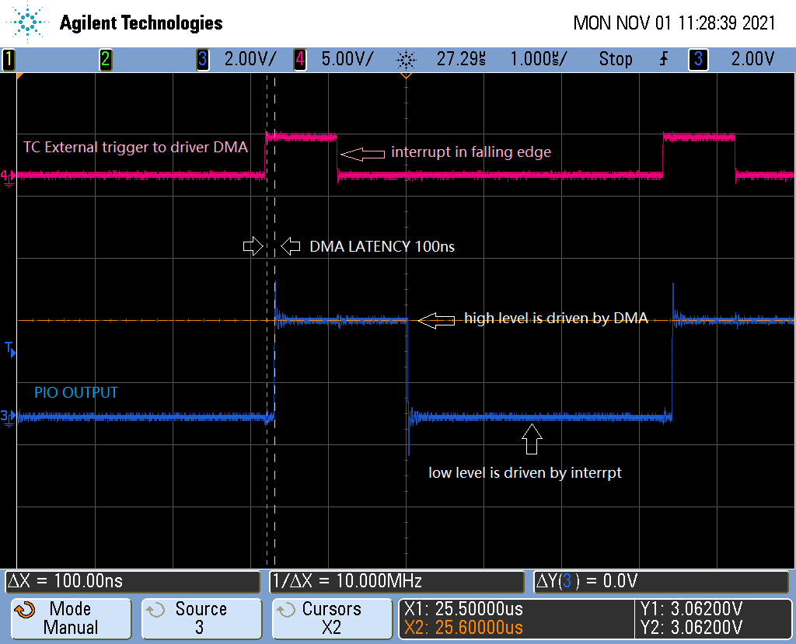

XDMA TRIGGER WITH TC EXAMPLE
===========================

# Objectives
------------
This example aims to test the DMA transfer with TC compare counter trigger or external trigger.

# Example Description
---------------------
This example shows how to configure DMA with TC compare counter trigger and external trigger.
In this trigger mode, it supports Memory-to-Peripheral and Memory-to-Memory transfer operations, 
and chunk size is programmable as well.

The code can be roughly broken down as follows:
 - Select pre-defined waveform frequency and duty cycle to be generated.
 - Configure TC channel as waveform output.
 - Configure a DMA channel for memory-to-memory transfer and trigger with TC compare counter.
 - Configure a DMA channel memory-to-peripheral transfer and trigger with TC compare counter.
 - Configure a DMA channel memory-to-peripheral transfer and trigger with external pin.
 
# Test
------
## Setup
--------
On the computer, open and configure a terminal application
(e.g. HyperTerminal on Microsoft Windows) with these settings:
 - 115200 bauds
 - 8 bits of data
 - No parity
 - 1 stop bit
 - No flow control

## Start the application
------------------------
In the terminal window, the following text should appear (values depend on the
board and chip used):
```
-- DMA with TC trigger example  --
-- SAMxxxxx-xx
-- Compiled: xxx xx xxxx xx:xx:xx --
```

```
Menu :
  -----
  Output waveform property:
  0: Set Frequency =  4 Hz, Duty Cycle = 30%
  1: Set Frequency =  8 Hz, Duty Cycle = 50%
  2: Set Frequency =  15 Hz, Duty Cycle = 75%
  3: Set Frequency =  30 Hz, Duty Cycle = 80%
  4: Set Frequency =  50 Hz, Duty Cycle = 55%
  4: Set Frequency =  80 Hz, Duty Cycle = 20%
  -------------------------------------------
  m: dma memory to memory example
  [+|-]: change chunk size (CHK_1,CHK_2,CHK_4,CHK_8,CHK_16 data transfer)
  p: dma memory to peripheral example
  t: Start dma transfer
  e: dma external trigger latency measurement
  h: Display menu
  ------
```
### SAM9X60-EK
----------------
Pins connection for dma external trigger latency measurement:
- PA3 is the output pin, driven by DMA for signal measurement.
- PA24 acts as the TC external trigger pin for signal measurement.

SAM9X60 Evaluation Kit(revA or revB):
 - Connect PA2 to PA24(CLASSD_L0_PA24)
	- PA2 is pin 11 in J17(revA)
	- PA2 is pin 11 in J16(revB)
 - PA3 is output pin
	- is pin 13 in J17 (revA)
	- is pin 15 in J16 (revB)
	- is driven high by DMA 
	- is driven low by PIO interrupt
 



Tested with IAR and GCC (sram and ddram configuration)

In order to test this example, the process is the following:
# For SAM9X60-EK
Step | Description | Expected Result | Result
-----|-------------|-----------------|-------
Press '0' | waveform | generate waveform frequency = 4 Hz, Duty cycle = 30% | PASSED
Press '1' | waveform | generate waveform frequency = 8 Hz, Duty cycle = 50% | PASSED
Press '2' | waveform | generate waveform frequency = 15 Hz, Duty cycle = 75% | PASSED
Press '3' | waveform | generate waveform frequency = 30 Hz, Duty cycle = 80% | PASSED
Press '4' | waveform | generate waveform frequency = 50 Hz, Duty cycle = 55% | PASSED
Press 'm' | configure DMA | DMA for memory-to-memory | PASSED
Press 't' | start DMA transfer | 1234567890...... | PASSED
Press '+' | chunk size | CHK_2  | PASSED
Press '+' | chunk size | CHK_4  | PASSED
Press '+' | chunk size | CHK_8  | PASSED
Press '-' | chunk size | CHK_4  | PASSED
Press 'm' | configure DMA | DMA for memory-to-memory | PASSED
Press 't' | start DMA transfer | 1234567890...... | PASSED
Press 'p' | configure DMA | DMA for memory-to-peripheral | PASSED
Press 't' | start DMA transfer | 1234567890...... | PASSED
Press 'h' | Print the menu | Display the menu | PASSED
Press 'e' | start DMA transfer | Start DMA transfer with external trigger, please measure signal... | PASSED
Measuring | measure signal | Measure latency from PA24 rising edge to PA2 rising edge (about 120ns)| PASSED
Press 'h' | Print the menu | Display the menu | PASSED